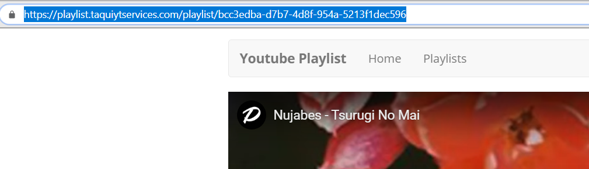

#  Playlist Application

## Abstract
This webapp enables multiple people to contribute music to a playlist. This project was created with AWS in the backend and used React for the frontend. The backend consisted of a GraphQL database using AWS AppSync. The project was also hosted on AWS. The purpose of the application was to learn more about how to create a full-stack severless project using AWS.
## Chapters
### 1. [Introduction](#introduction)
### 2. [Background and Complications](#background-and-complications)
### 3. [Technology Stack](#technology-stack)
### 4. [Code](#code)
### 5. [Application Flow](#application-flow)
### 6. [Future](#future)

## Introduction
This application is a Fullstack project with a complete Frontend and Backend, and the project is also hosted on [AWS](https://aws.amazon.com/what-is-aws/). This application was created to enable multiple people to contribute music/videos to a playlist. The created playlists can only be played by the person who created the playlist. The purpose of this application is to be used in social gatherings or parties where multiple people want to suggest songs to be played. In this application, all they have to do is follow the link with the correct ID and they will be able to contribute whatever song/video they want.  All the code is commented. In this documentation, there will be links to the files.

The project is currently live [https://playlist.taquiytservices.com/](https://playlist.taquiytservices.com/).

## Background and Complications
The purpose of creating this project was to be able to learn more about how to create a serverless API that can be used in an application. The application changed however where it originally started as a RESTful API using AWS Lambda to a GraphQL database using AWS AppSync. The main reason for this change was the need for Real-Time Updates. Therefore, having a pure RESTful API was insufficient for this project.

## Technology Stack
The Technology Stack is rather simple. The project is entirely serverless. The Project used [React](https://aws.amazon.com/cognito/) for the frontend and [AppSync](https://aws.amazon.com/appsync/) in the backend. [AWS Cognito](https://aws.amazon.com/cognito/) was used for Authentication.  

The frontend used [React](https://aws.amazon.com/cognito/) as well as [Bootstrap 3](https://react-bootstrap-v3.netlify.com/components/alerts/) for some of the styling. [React Router](https://reacttraining.com/react-router/web/guides/quick-start) was used for navigating the webpage. [AWS Amplify](https://aws-amplify.github.io/docs/cli-toolchain/quickstart) was used to make the configuration easy for the Athentication and the use of the database.

The choice to use AppSync with GraphQL was mandatory. In this application when a playlist is updated it is done in Real-Time. Therefore, some form of subscription was necessary to make the application work. Subscriptions were included in AppSync which made the application possible.    

The project was also hosted on AWS using an [S3 bucket](https://aws.amazon.com/s3/). [CloudFront](https://aws.amazon.com/cloudfront/) was used as a CDN for the application. In its current state www support has not been added. [Amplify CLI](https://aws-amplify.github.io/docs/cli-toolchain/quickstart) was used for creating all the resources on the cloud and for making it easier to create new updates.

## Code
In this section, I mention the most important aspects of the code which is mostly going to be about the interaction with Cognito and with AppSync. The code is commented so if you want more details you can look at the specific files.

In the file [mock-config.js](https://github.com/Internet-Person-IP/Playlist-Application/blob/master/src/config-mock.js), we can see what variables are necessary for the setup of the Application. Both the Cognito User Pool and the GraphQL API  variables are here for the setup. The actual setup occurs in [index.js](https://github.com/Internet-Person-IP/Playlist-Application/blob/master/src/index.js). Later on in the project, we import these for the authentication and for making GraphQL queries. In [index.js](https://github.com/Internet-Person-IP/Playlist-Application/blob/master/src/index.js) we also see the setup for Router for navigation of the application.

If you want to see the actual paths of the application you can go to [src/Routes.js](https://github.com/Internet-Person-IP/Playlist-Application/blob/master/src/Routes.js)

Authentication is done in [src/App.js](https://github.com/Internet-Person-IP/Playlist-Application/blob/master/src/App.js) and in [src/containers/Login.js](https://github.com/Internet-Person-IP/Playlist-Application/blob/master/src/containers/Login.js). [Login.js](https://github.com/Internet-Person-IP/Playlist-Application/blob/master/src/containers/Login.js) places we can how Cognito is used for authentication. In App.js we can see how a session is being maintained using [currentAthenticatedUser](https://aws-amplify.github.io/docs/js/authentication#retrieve-current-authenticated-user).

The main application is in [Playlist.js](https://github.com/Internet-Person-IP/Playlist-Application/blob/master/src/containers/Playlist.js). Here we can see how the CRUD operations are used to create/delete songs in the playlist. We are also able to see how the subscription is handled in the code. The actual queries can be viewed in [src/graphql/](https://github.com/Internet-Person-IP/Playlist-Application/tree/master/src/graphql). Here you will be able to see the specific queries sent to the GraphQL API. In [Playlist.js](https://github.com/Internet-Person-IP/Playlist-Application/blob/master/src/containers/Playlist.js) you will be able to observe how I managed the change of songs automatically to the next song in the playlist but also how the owner can change song by clicking a specific song. Another important aspect is the player that was used. There exist an npm package called [ReactPlayer](https://www.npmjs.com/package/react-player) this component had specific props that were important. There was a onEnd prop that made it possible to run a function when a song had ended. Which aided with the switch to the next song.

## Usage
The Application Flow is simple enough but I want to make it 100% clear for people if there happens to be any confusion.

### 1. The User has to Sign Up for the application
The user has to navigate to the Sign Up Page. This can be done by clicking the Signup button on the navbar.  The user writes in email and password when prompted to.

 

### 2. The User verifies their Email Address
The user will be redirected to a page where they have to write in their Confirmation Code. The user has to log into the email that they signed up with and get the verification code and input it. The user will then be automatically signed in.
 

### 3. The User Signs in to the Application
Users can log in directly to the application as well. If the user decides to logout and wants to login again this is possible on the login page. This can found by clicking login on the navbar.
 

### 4. The User can then create a playlist.
The User can create a playlist by navigating to the playlist by clicking the playlist link on the navbar. 
 

Once they are on the page they can create a playlist by clicking the create playlist button and writing in a playlist name.
 

After that, the playlist will be displayed.
 

### 5. The User can add, play and delete Songs
The user can access a playlist by clicking on the specific playlist they created. He can do this by copying and pasting a youtube URL in the input field and then clicking the add to playlist button.
 

Based on the picture below the User that created the playlist can add Songs. They also have a delete button so that they can delete a song from the playlist.  
 

### 6. The User can share the playlist to other Users
The owner can share the playlist with other people by copying the link of the playlist. 
 

The user that is not the owner will have a different view compared to the owner. Sharing the link that the owner is currently on, other users can add songs to the playlist. They are unable to make any other changes besides adding songs. They cannot play the playlist only the owner can.
 

## Future

I will add Spotify and SoundCloud support to make it able to play Spotify music as well as music from youtube. There are also plans for Mobile Version of this application using React Native.

Possible in the future there will be an indication of which song is currently playing. This notification will be sent to people that are not the owner of the playlist.

## Bugs
The only bug that I am currently aware of is that if you refresh the page where while you are getting your verification code you will be unable to Sign Up. Another problem that currently exists is that all playlists have the same thumbnail. Also currently there is no way for the users to change passwords or emails. Another issue is that there is no way to delete a playlist. 

